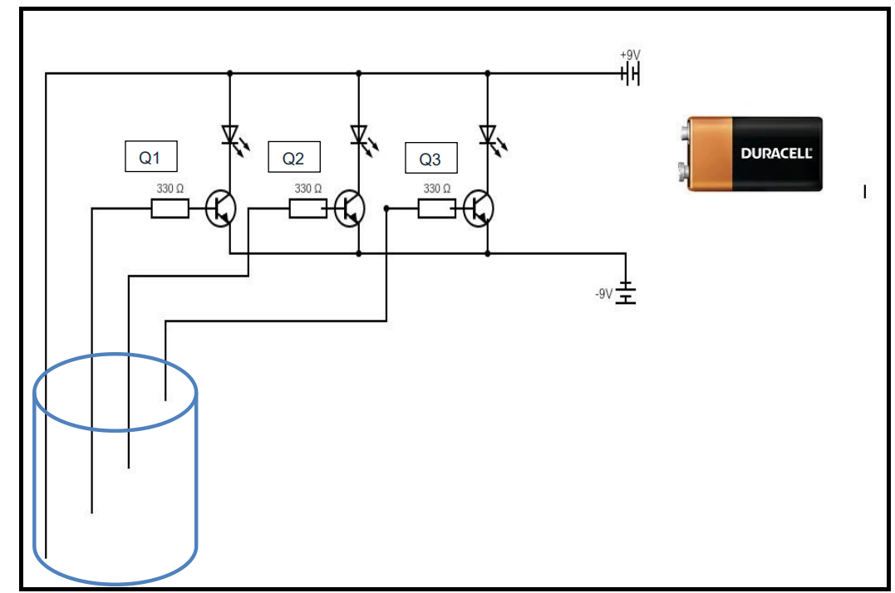
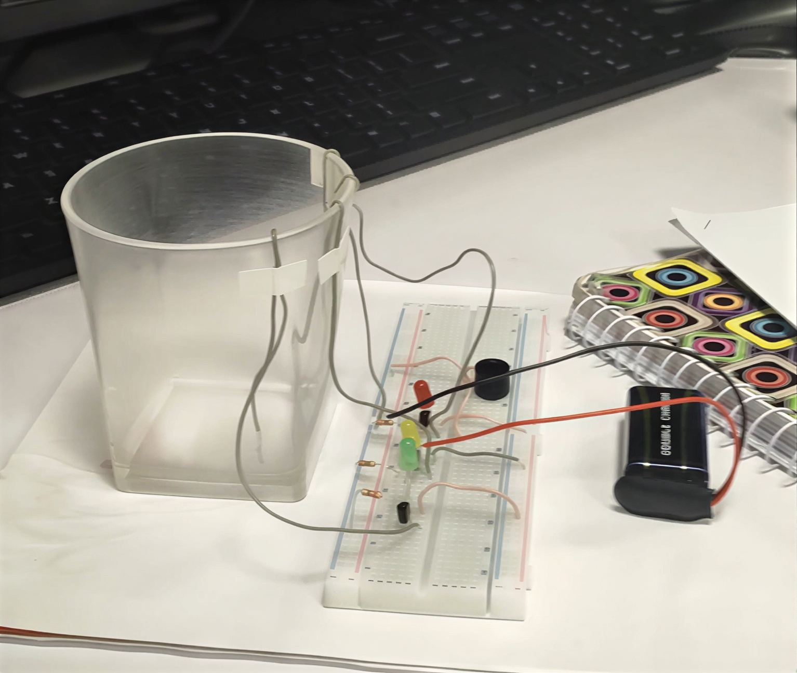

# 💧 Water Level Detection System

An LED-based water level indicator built with BC547 transistors, three color-coded LEDs, and conductive probes. Designed as a hands-on project for **Digital Logic Design** course to demonstrate transistor switching in real-world sensing applications.

**Course:** Digital Logic Design  
**Semester:** 2nd Semester  
**Language/Technology:** Analog Electronics, Transistor Switching

---

## 🎯 Features

| Feature | Description |
|---------|-------------|
| Three-Level Detection | Low (Red), Medium (Yellow), High (Green) |
| Transistor Switching | BC547 NPN transistors act as electronic switches |
| Visual Feedback | LEDs light up instantly when water touches probes |
| Current Protection | 330Ω resistors protect LEDs from overcurrent |
| Breadboard Prototype | No soldering required, easy to test and modify |

---

## 🛠 Components Used

| Component | Quantity | Purpose |
|-----------|----------|---------|
| Breadboard | 1 | Circuit assembly |
| 9V Battery with Holder | 1 | Power supply |
| BC547 NPN Transistors | 3 | Electronic switches |
| LEDs (Red, Yellow, Green) | 3 | Level indicators |
| 330Ω Resistors | 3 | Current limiting |
| Jumper Wires | As needed | Connections |
| Conductive Probes | 3 | Water level sensors |
| Glass/Plastic Tank | 1 | Water container |

---

## ⚙️ How It Works

1. **Transistor as a Switch** – Each BC547 transistor controls one LED. When water touches a probe, it provides a small base current that saturates the transistor, allowing a larger current to flow through the LED.

2. **Level Detection** – Three probes are placed at different heights inside the tank:
   - **Low Level** → Red LED turns on
   - **Medium Level** → Yellow LED turns on
   - **High Level** → Green LED turns on

3. **Current Limiting** – 330Ω resistors limit LED current to ~21.8mA, preventing damage.

4. **Water Conductivity** – Tap water contains minerals that conduct electricity, completing the base circuit when the probe is submerged.

---

## 📊 Test Results

| Water Level | Active LEDs | Color |
|-------------|-------------|-------|
| No water / Dry | None | — |
| Low only | 1 | Red |
| Low + Medium | 2 | Red + Yellow |
| All three levels | 3 | Red + Yellow + Green |

**All tests passed.** Response time was instantaneous. No components were damaged.

---

## 🖼 Project Images

> *(Images will appear here once uploaded)*

| Circuit Diagram | Hardware Setup |
|----------------|----------------|
|  |  |

---

## 📂 Project Structure
